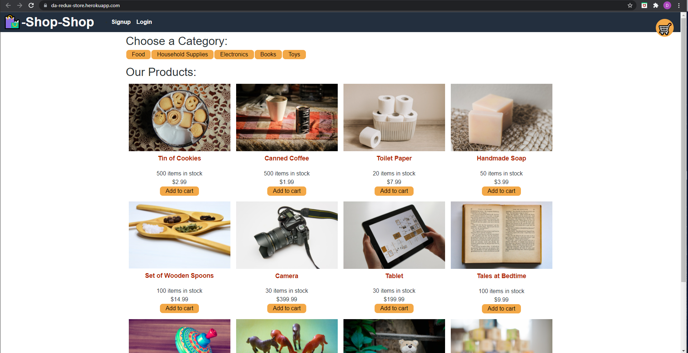

# redux-Store

    
    
    
    

  

    
    
    
    
  

## Description 

Refactored from using React's Context API, this MERN stack e-commerce app implements redux to handle state management. Like most e-commerce shops, users are able to add items and "checkout" using Stripe, and those items will then be added to the users order history. Users are also able to select item categories to sort through and find specific types of items. Learning different and emerging technologies will be a consistent task for developers, so practing refactoring with different state management systems provided an essential learning opportunity for the future as a full stack developer.

## Table of Contents 📖

- [Technologies Used](#technologies-used-%EF%B8%8F)
- [Installation](#installation-%EF%B8%8F)
- [Usage Demo](#usage-demo)
- [License](#license-)

## Technologies Used 🖥️

| Technology  | Link                                    |
| ----------- | --------------------------------------- |
| MongoDB     | https://www.mongodb.com/                |
| Express     | https://expressjs.com/                  |
| React       | https://reactjs.org/                    |
| Node.js     | https://nodejs.org/en/                  |
| Redux       | https://redux.js.org/                   |

## Installation ⚙️

1. Download a copy of this repository
2. Make sure you have Node.js and npm installed
    - Install necessary npm packages via `npm install`
3. Navigate to the file location of the downloaded repository using the command line
5. Enter `npm run develop` to run and start the application.

## Usage Demo

[Live Application](https://da-redux-store.herokuapp.com/)

## License 

MIT
